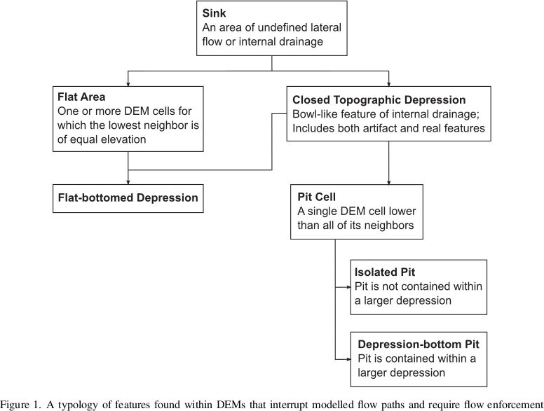

Depression-Filling
==================

Depressions, otherwise known as pits, are areas of a landscape wherein flow
ultimately terminates without reaching an ocean or the edge of a digital
elevation model.

Depressions, Pits, and Sinks
----------------------------

Depressions have been called by a variety of names. To clarify this mess,
Lindsay (2016) provides a typology. This typology is followed here.

Original DEM
----------------------------

For reference, the original DEM appears as follows:

.. plot::
    :width: 800pt
    :include-source:
    :context: reset
    :outname: depression_original

    import richdem as rd
    import numpy as np
    
    beau    = rd.rdarray(np.load('imgs/beauford.npz')['beauford'], no_data=-9999)
    beaufig = rd.rdShow(beau, ignore_colours=[0], axes=False, cmap='jet', figsize=(8,5.5))

Complete Filling
----------------------------

Depression-filling is often used to fill in all the depressions in a DEM to the
level of their lowest outlet or spill-point.

The result looks as follows:

.. plot::
    :width: 800pt
    :include-source:
    :context: close-figs
    :outname: depression_complete

    beau_filled    = rd.FillDepressions(beau, in_place=False)
    beaufig_filled = rd.rdShow(beau_filled, ignore_colours=[0], axes=False, cmap='jet', vmin=beaufig['vmin'], vmax=beaufig['vmax'], figsize=(8,5.5))

We can visualize the difference between the two like so:

.. plot::
    :width: 800pt
    :include-source:
    :context: close-figs
    :outname: depression_complete_original_diff

    beau_diff    = beau_filled - beau
    beaufig_diff = rd.rdShow(beau_diff, ignore_colours=[0], axes=False, cmap='jet', figsize=(8,5.5))

Complete Filling is available via the following commands:

================= ==============================
Language          Command
================= ==============================
Python            `richdem.FillDepressions()`
C++               `richdem::FillDepression<Topology>()`
================= ==============================

+----------------+--------------------------------------+
|Pros            |  Cons                                |
+----------------+--------------------------------------+
| - *Fast*       | - Leaves flat regions behind         |
| - Simple       | - May modify large portions of a DEM |
+----------------+--------------------------------------+

.. _epsilon-filling-label:

Epsilon Filling
----------------------------

A downside of complete filling is that it replaces depressions with a perfectly
flat region with no local gradients. One way to deal with this is to ensure that
every cell in the region is raised some small amount, ε, above cells which are
closer to a depression's spill point.

This must be done carefully. In floating-point DEMs, the value ε is non-constant
and must be chosen using the !`std::nextafter` function. If a depression is too
large, the imposed gradient may result in the interior of the depression being
raised above the surrounding landscape. Using `double` instead of `float`
reduces the potential for problems at a cost of twice the space used. If a
problem does arise, RichDEM provides a warning.

We can visualize the difference between the epsilon-filled DEM and the original
DEM like so:

.. plot::
    :width: 800pt
    :include-source:
    :context: close-figs
    :outname: depression_eps_diff

    beau_epsilon         = rd.FillDepressions(beau, epsilon=True, in_place=False)
    beau_eps_diff        = beau_epsilon - beau
    beaufig_eps_diff     = rd.rdShow(beau_eps_diff, ignore_colours=[0], axes=False, cmap='jet', figsize=(8,5.5))

We can visualize the difference between the epsilon-filled DEM and the
completely-filled DEM as follows. Note that elevation increases with distance
from the depression's outlet: this is the effect of the epsilon.

.. plot::
    :width: 800pt
    :include-source:
    :context: close-figs
    :outname: depression_filled_eps_diff

    beau_diffeps_diff    = beau_epsilon - beau_filled
    beaufig_diffeps_diff = rd.rdShow(beau_diffeps_diff, ignore_colours=[0], axes=False, cmap='jet', figsize=(8,5.5))

================= ============================================
Language          Command
================= ============================================
Python            `richdem.FillDepressions()`
C++               `richdem::FillDepressionsEpsilon<Topology>()`
================= ============================================

+-------------------+--------------------------------------------+
|Pros               | Cons                                       |
+-------------------+--------------------------------------------+
| - All cells drain | - Not as fast as simple depression filling |
|                   | - May modify large portions of a DEM       |
|                   | - May create elevated regions              |
|                   | - Success may depend on data type          |
+-------------------+--------------------------------------------+
