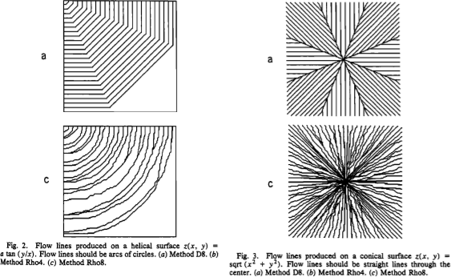
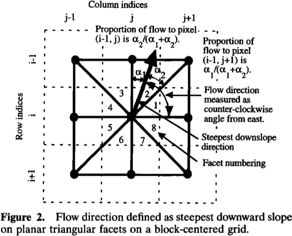
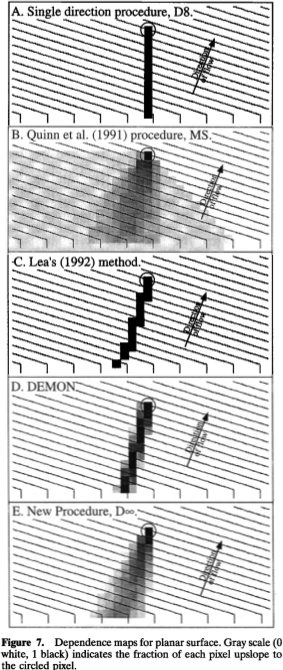

Flow Metrics
============

A flow metric is a rule which apportions the flow passing through a cell into
one or more of its neighbours.

The problem of how to best do this has been considered many times, since it is
difficult to discretize flow onto a grid, and a number of solutions have been
presented. Rather than choosing one, RichDEM instead incorporates many and
leaves it to the user to decide which is appropriate.

Below, the various flow metrics included in RichDEM are discussed.

Wherever possible, algorithms are named according to the named according to
their creators as well as by the name the authors gave the algorithm. For
instance, `FM_Rho8` and `FM_FairfieldLeymarieD8` refer to the same function.

All flow metric functions are prefixed with !`FM_`.

Note that, in some cases, it is difficult or impossible to include a flow metric
because the authors have included insufficient detail in their manuscript and
have not provided source code. In these cases, the flow metric will either be
absent or a "best effort" attempt has been made at implementation.

Flow Coordinate System
--------------------------------

Internally, RichDEM refers to flow directions using a neighbourhood that appears
as follows::

    234
    105
    876

Neighbouring cells are accessed by looping through the indices 1 through 8
(inclusive) of the `dx[]` and `dy[]` arrays.

Convergent and Divergent Metrics
--------------------------------

The greatest difference between flow metrics is in whether they are convergent
or divergent. In a convergent method rivers only ever join: they never diverge
or bifurcate. This means that landscape structures such as braided rivers cannot
be adequately represented by a convergent method.

In a divergent method rivers may join and split, so braided rivers can be
represented.

In general, convergent methods are simpler and therefore faster to use. There is
a large diversity of divergent methods.

Note on the examples
-------------------------------

Epsilon depression-filling replaces a depression with a predictable, convergent
flow pattern. Beauford watershed has a number of depressions, as is evident in
the example images below. A flow metric should not necessarily be judged by its
behaviour within a filled depression. For convenience, a zoomed view of a non-
depression area is shown and, at the end of this chapter, the views are
compared.

D8 (O'Callaghan and Mark, 1984)
-------------------------------

    O'Callaghan, J.F., Mark, D.M., 1984. The Extraction of Drainage Networks from Digital Elevation Data. Computer vision, graphics, and image processing 28, 323--344.

The D8 method assigns flow from a focal cell to one and only one of its 8
neighbouring cells. The chosen neighbour is the one accessed via the steepest
slope. When such a neighbour does not exist, no flow direction is assigned. When
two or more neighbours have the same slope, the chosen neighbour is the first
one considered by the algorithm.

This is a convergent, deterministic flow method.

.. plot::
    :width: 800pt
    :include-source:
    :context: reset
    :outname: flow_metric_d8

    import richdem as rd
    import numpy as np

    dem = rd.rdarray(np.load('imgs/beauford.npz')['beauford'], no_data=-9999)

    rd.FillDepressions(dem, epsilon=True, in_place=True)
    accum_d8 = rd.FlowAccumulation(dem, method='D8')
    d8_fig = rd.rdShow(accum_d8, zxmin=450, zxmax=550, zymin=550, zymax=450, figsize=(8,5.5), axes=False, cmap='jet')

================= ==============================
Language          Command
================= ==============================
C++               `richdem::FM_OCallaghanD8()` or `richdem::FM_D8()`
================= ==============================

D4 (O'Callaghan and Mark, 1984)
-------------------------------

    O'Callaghan, J.F., Mark, D.M., 1984. The Extraction of Drainage Networks from Digital Elevation Data. Computer vision, graphics, and image processing 28, 323--344.

The D4 method assigns flow from a focal cell to one and only one of its 4 north,
south, east, or west neighbouring cells. The chosen neighbour is the one
accessed via the steepest slope. When such a neighbour does not exist, no flow
direction is assigned. When two or more neighbours have the same slope, the
chosen neighbour is the first one considered by the algorithm.

This is a convergent, deterministic flow method.

.. plot::
    :width: 800pt
    :include-source:
    :context: close-figs
    :outname: flow_metric_d4

    import richdem as rd
    import numpy as np

    dem = rd.rdarray(np.load('imgs/beauford.npz')['beauford'], no_data=-9999)

    rd.FillDepressions(dem, epsilon=True, in_place=True)
    accum_d4 = rd.FlowAccumulation(dem, method='D4')
    d8_fig = rd.rdShow(accum_d4, zxmin=450, zxmax=550, zymin=550, zymax=450, figsize=(8,5.5), axes=False, cmap='jet')

================= ==============================
Language          Command
================= ==============================
C++               `richdem::FM_OCallaghanD4()` or `richdem::FM_D4()`
================= ==============================

Rho8 (Fairfield and Leymarie, 1991)
-----------------------------------

    Fairfield, J., Leymarie, P., 1991. Drainage networks from grid digital elevation models. Water resources research 27, 709–717.

The Rho8 method apportions flow from a focal cell to one and only one of its 8
neighbouring cells. To do so, the slope to each neighbouring cell is calculated
and a neighbouring cell is selected randomly with a probability weighted by the
slope.

This is a convergent, stochastic flow method.

.. plot::
    :width: 800pt
    :include-source:
    :context: close-figs
    :outname: flow_metric_rho8

    accum_rho8 = rd.FlowAccumulation(dem, method='Rho8')
    rd.rdShow(accum_rho8, zxmin=450, zxmax=550, zymin=550, zymax=450, figsize=(8,5.5), axes=False, cmap='jet', vmin=d8_fig['vmin'], vmax=d8_fig['vmax'])

================= ==============================
Language          Command
================= ==============================
C++               `richdem::FM_Rho8()` or `richdem::FM_FairfieldLeymarieD8()`
================= ==============================

Rho4 (Fairfield and Leymarie, 1991)
-----------------------------------

    Fairfield, J., Leymarie, P., 1991. Drainage networks from grid digital elevation models. Water resources research 27, 709–717.

The Rho4 method apportions flow from a focal cell to one and only one of its 8
neighbouring cells. To do so, the slope to each neighbouring cell is calculated
and a neighbouring cell is selected randomly with a probability weighted by the
slope.

This is a convergent, stochastic flow method.

.. plot::
    :width: 800pt
    :include-source:
    :context: close-figs
    :outname: flow_metric_rho4

    accum_rho4 = rd.FlowAccumulation(dem, method='Rho4')
    rd.rdShow(accum_rho4, zxmin=450, zxmax=550, zymin=550, zymax=450, figsize=(8,5.5), axes=False, cmap='jet', vmin=d8_fig['vmin'], vmax=d8_fig['vmax'])

================= ==============================
Language          Command
================= ==============================
C++               `richdem::FM_Rho4()` or `richdem::FM_FairfieldLeymarieD4()`
================= ==============================

Quinn (1991)
-------------------------------

    Quinn, P., Beven, K., Chevallier, P., Planchon, O., 1991. The Prediction Of Hillslope Flow Paths For Distributed Hydrological Modelling Using Digital Terrain Models. Hydrological Processes 5, 59–79.

The Quinn (1991) method apportions flow from a focal cell to one or more, and
possibly all, of its 8 neighbouring cells. To do so, the amount of flow
apportioned to each neighbour is a function :math:`\tan(\beta)^1` of the slope
:math:`\beta` to that neighbour. This is a special case of the Holmgren (1994)
method.

This is a divergent, deterministic flow method.

.. plot::
    :width: 800pt
    :include-source:
    :context: close-figs
    :outname: flow_metric_quinn1991

    accum_quinn = rd.FlowAccumulation(dem, method='Quinn')
    rd.rdShow(accum_quinn, zxmin=450, zxmax=550, zymin=550, zymax=450, figsize=(8,5.5), axes=False, cmap='jet', vmin=d8_fig['vmin'], vmax=d8_fig['vmax'])

================= ==============================
Language          Command
================= ==============================
C++               `richdem::FM_Quinn()`
================= ==============================

Freeman (1991)
-------------------------------

    Freeman, T.G., 1991. Calculating catchment area with divergent flow based on a regular grid. Computers & Geosciences 17, 413–422.

The Freeman (1991) method apportions flow from a focal cell to one or more, and
possibly all, of its 8 neighbouring cells. To do so, the amount of flow
apportioned to each neighbour is a function of the slope to that neighbour and a
tuning parameter :math:`p`. In particular, the fraction :math:`f_i` of flow
apportioned to neighbour :math:`i` is

.. math::

    f_i = \frac{\max(0,\beta_i^p)}{\sum_{j \in N} \max(0,\beta_j^p)}

Freeman recommends choosing :math:`p \approx 1.1`.

This is a divergent, deterministic flow method.

.. plot::
    :width: 800pt
    :include-source:
    :context: close-figs
    :outname: flow_metric_freeman1991

    accum_freeman = rd.FlowAccumulation(dem, method='Freeman', exponent=1.1)
    rd.rdShow(accum_freeman, zxmin=450, zxmax=550, zymin=550, zymax=450, figsize=(8,5.5), axes=False, cmap='jet', vmin=d8_fig['vmin'], vmax=d8_fig['vmax'])

================= ==============================
Language          Command
================= ==============================
C++               `richdem::FM_Freeman()`
================= ==============================

Holmgren (1994)
-------------------------------

    Holmgren, P., 1994. Multiple flow direction algorithms for runoff modelling in grid based elevation models: an empirical evaluation. Hydrological processes 8, 327–334.

.. todo:: Add a comparison figure from Holmgren (1994)

The Holmgren (1994) method apportions flow from a focal cell to one or more, and
possibly all, of its 8 neighbouring cells. To do so, the amount of flow
apportioned to each neighbour is a function of the slope that neighbour and a
user-specified exponent :math:`x`. In particular, the fraction :math:`f_i` of
flow apportioned to neighbour :math:`i` is

.. math::

    f_i = \frac{(\tan \beta_i)^x}{\sum_{j \in N} (tan \beta_j)^x} \forall \tan \beta > 0

This is a generalization of the Quinn (1991) method in which the exponent is 1.
As :math:`x \rightarrow \infty`, this method approximates the D8 method.

Holmgren recommends choosing :math:`x \in [4,6]`.

This is a divergent, deterministic flow method.

.. plot::
    :width: 800pt
    :include-source:
    :context: close-figs
    :outname: flow_metric_holmgren1994

    accum_holmgren = rd.FlowAccumulation(dem, method='Holmgren', exponent=5)
    rd.rdShow(accum_holmgren, zxmin=450, zxmax=550, zymin=550, zymax=450, figsize=(8,5.5), axes=False, cmap='jet', vmin=d8_fig['vmin'], vmax=d8_fig['vmax'])

================= ==============================
Language          Command
================= ==============================
C++               `richdem::FM_Holmgren()`
================= ==============================

D∞ (Tarboton, 1997)
-------------------------------

    Tarboton, D.G., 1997. A new method for the determination of flow directions and upslope areas in grid digital elevation models. Water resources research 33, 309–319.

The D∞ method apportions flow from a focal cell between one or two adjacent
neighbours of its 8 neighbouring cells. To do so, a line of steepest descent is
calculated by doing localized surface fitting between the focal cell and
adjacent pairs of its neighbouring cell. This line often falls between two
neighbours.

This is a divergent, deterministic flow method.

.. plot::
    :width: 800pt
    :include-source:
    :context: close-figs
    :outname: flow_metric_tarboton1997

    accum_dinf = rd.FlowAccumulation(dem, method='Dinf')
    rd.rdShow(accum_dinf, zxmin=450, zxmax=550, zymin=550, zymax=450, figsize=(8,5.5), axes=False, cmap='jet', vmin=d8_fig['vmin'], vmax=d8_fig['vmax'])

================= ==============================
Language          Command
================= ==============================
C++               `richdem::FM_Tarboton()` or `richdem::FM_Dinfinity()`
================= ==============================

Side-by-Side Comparisons of Flow Metrics
----------------------------------------

.. plot::
    :width:   800pt
    :height:  600pt
    :context: close-figs
    :outname: flow_metric_comparison

    metrics = (
      ('D8',       accum_d8      ),
      ('D4',       accum_d4      ),
      ('Rho8',     accum_rho8    ),
      ('Rho4',     accum_rho4    ),
      ('Dinf',     accum_dinf    ),
      ('Quinn',    accum_quinn   ),
      ('Holmgren', accum_holmgren),
      ('Freeman',  accum_freeman )
    )

    subr = lambda x: x[450:550,450:550]

    fig, axs = plt.subplots(nrows=2, ncols=4)

    #Flatten list
    axs = [item for sublist in axs for item in sublist]

    vmin, vmax = np.nanpercentile(subr(accum_d4), [2, 98])

    for i, met in enumerate(metrics):
      axs[i].imshow(subr(met[1]), vmin=vmin, vmax=vmax, cmap='jet')
      axs[i].set_title(met[0])

    plt.tight_layout()
    plt.show()

Note that Quinn (1991) and Freeman (1991) produce rather similar results;
nonetheless, they are different:

.. plot::
    :width:   800pt
    :height:  600pt
    :context: close-figs
    :outname: flow_metric_quinn_freeman_compare

    quinn_freeman_diff = accum_quinn - accum_freeman
    rd.rdShow(quinn_freeman_diff, figsize=(8,5.5), axes=False, cmap='jet', ignore_colours=[0])

Accessing Flow Proportions Directly
===================================

In higher-level languages the foregoing flow proportions can be access via the
flow proportions command, such as follows:

.. code-block:: python

    bprops = rd.FlowProportions(dem=beau, method='D8')

This command returns a matrix with the same width and height as the input, but
an extra dimension which assigns each `(x,y)` cell 9 single-precision floating-
point values.

The zeroth of these values is used for storing status information about the cell
as a whole. If the 0th value of the area is `0` then the cell produces flow; if
it is `-1`, then the cell produces no flow; if it is `-2`, then the cell is a
NoData cell. The following eight values indicate the proportion of the cells
flow directed to the neighbour corresponding to the index of that value where
the neighbours are defined as in `Flow Coordinate System`_.

For instance, the values::

    0 0.25 0.25 0.25 0.25 0 0 0 0

direct 25% of a cell's flow to the northwest, north, northeast, and east.

These values can be manipulated and used to generate custom flow accumulations.