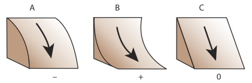
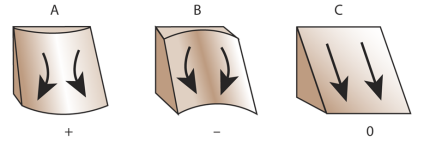
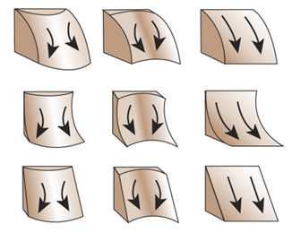

Terrain Attributes
======================================

RichDEM can calculate a number of terrain attributes.

.. todo:: TA_SPI TA_CTI

Slope
--------------------------------------

    Horn, B.K.P., 1981. Hill shading and the reflectance map. Proceedings of the IEEE 69, 14–47. doi:10.1109/PROC.1981.11918

Horn (1981) calculates the slope of a focal cell by using a central difference
estimation of a surface fitted to the focal cell and its neighbours. The slope
chosen is the maximum of this surface and can be returned in several formats.

.. plot::
    :width: 800pt
    :include-source:
    :context: reset
    :cached: auto_gen_imgs/terrain_slope

    import richdem as rd
    import numpy as np
    
    beau  = rd.rdarray(np.load('imgs/beauford.npz')['beauford'], no_data=-9999)
    slope = rd.TerrainAttribute(beau, attrib='slope_riserun')
    rd.rdShow(slope, axes=False, cmap='jet', figsize=(8,5.5))

================= ==============================
Language          Command
================= ==============================
Python            `richdem.TerrainAttribute()`
C++               `richdem::TA_slope_riserun()`
C++               `richdem::TA_slope_percentage()`
C++               `richdem::TA_slope_degrees()`
C++               `richdem::TA_slope_radians()`
================= ==============================

Aspect
--------------------------------------

    Horn, B.K.P., 1981. Hill shading and the reflectance map. Proceedings of the IEEE 69, 14–47. doi:10.1109/PROC.1981.11918

Horn (1981) calculates aspect as the direction of the maximum slope of the focal
cell. The value returned is in Degrees.

.. plot::
    :width: 800pt
    :include-source:
    :context: close-figs
    :cached: auto_gen_imgs/terrain_aspect

    aspect = rd.TerrainAttribute(beau, attrib='aspect')
    rd.rdShow(aspect, axes=False, cmap='jet', figsize=(8,5.5))

================= ==============================
Language          Command
================= ==============================
Python            `richdem.TerrainAttribute()`
C++               `richdem::TA_aspect()`
================= ==============================

Profile Curvature
--------------------------------------

    Zevenbergen, L.W., Thorne, C.R., 1987. Quantitative analysis of land surface topography. Earth surface processes and landforms 12, 47–56.

Profile curvature is calculated by fitting a surface to the focal cell and its
neighbours. The profile curvature runs parallel to the maximum slope of this
surface and affects the acceleration and deceleration of flow down the slope.

Negative profile curvatures (A) indicate upwardly convex slopes, positive
profile curvatures (B) indicate upwardly concave surfaces, and a profile
curvature of zero indicates a linear slope (C).

.. plot::
    :width: 800pt
    :include-source:
    :context: close-figs
    :cached: auto_gen_imgs/terrain_profile_curvature

    profile_curvature = rd.TerrainAttribute(beau, attrib='profile_curvature')
    rd.rdShow(profile_curvature, axes=False, cmap='jet', figsize=(8,5.5))

================= ==============================
Language          Command
================= ==============================
Python            `richdem.TerrainAttribute()`
C++               `richdem::TA_profile_curvature()`
================= ==============================

Planform Curvature
--------------------------------------

    Zevenbergen, L.W., Thorne, C.R., 1987. Quantitative analysis of land surface topography. Earth surface processes and landforms 12, 47–56.

Planform curvature is calculated by fitting a surface to the focal cell and its
neighbours. The planform curvature runs perpendicular to the maximum slope of
this surface and affects the convergence and divergence of flow down the slope.

Negative planform curvatures (A) indicate laterally convex slopes, positive
planform curvatures (B) indicate laterally concave surfaces, and a planform
curvature of zero indicates a linear slope (C).

.. plot::
    :width: 800pt
    :include-source:
    :context: close-figs
    :cached: auto_gen_imgs/terrain_planform_curvature

    planform_curvature = rd.TerrainAttribute(beau, attrib='planform_curvature')
    rd.rdShow(planform_curvature, axes=False, cmap='jet', figsize=(8,5.5))

================= ==============================
Language          Command
================= ==============================
Python            `richdem.TerrainAttribute()`
C++               `richdem::TA_planform_curvature()`
================= ==============================

Curvature
--------------------------------------

    Zevenbergen, L.W., Thorne, C.R., 1987. Quantitative analysis of land surface topography. Earth surface processes and landforms 12, 47–56.

Curvature is calculated by fitting a surface to the focal cell and its
neighbours. It combines profile and planform curvature.

.. plot::
    :width: 800pt
    :include-source:
    :context: close-figs
    :cached: auto_gen_imgs/terrain_curvature

    curvature = rd.TerrainAttribute(beau, attrib='curvature')
    rd.rdShow(curvature, axes=False, cmap='jet', figsize=(8,5.5))

================= ==============================
Language          Command
================= ==============================
Python            `richdem.TerrainAttribute()`
C++               `richdem::TA_curvature()`
================= ==============================

.. todo:: In the following diagram, the columns show the planform curves and the rows show the profile curve. The planform columns are positive, negative, and 0—going from left to right. The profiles curves are negative, positive, and 0—going from top to bottom.